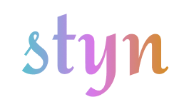
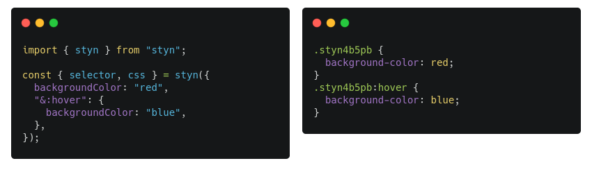

<p align="center">
  
</p>

<p align="center">
<strong>styn</strong> is a small, zero-dependency, extensible, js object to css generator
</p>

<p align="center">
  
</p>

## Table of Contents

- [Usage](#usage)
- - [CSS](#css)
- - [Element](#element)
- [Plugins](#plugins)
- [React](#react)

## Usage

### CSS

```js
import { css } from "styn";

const styles = css({
  ".foo": {
    backgroundColor: "red",
    "&:hover": {
      backgroundColor: "blue",
    },
  },
  ".bar": {
    color: "yellow",
  },
});
```

**Outputs to:**

styles

```css
.foo {
  background-color: red;
}
.foo:hover {
  background-color: blue;
}
.bar {
  color: yellow;
}
```

**css** also accepts at-rules like @keyframes, @font-face, etc.

```js
import { css } from "styn";

const styles = css({
  "@keyframes pulse": {
    from: {
      backgroundColor: "red",
    },
    to: {
      backgroundColor: "blue",
    },
  },
  ".foo": {
    animationName: "pulse",
  },
});
```

### Element

You can create a scoped element (omit className option to generated one)

```js
import { element } from "styn";

const { className, styles } = element({
  backgroundColor: "red",
  "&:hover": {
    backgroundColor: "blue",
  },
});
```

**Outputs to:**

className: `'styn4b5pb'`

styles:

```css
.styn4b5pb {
  background-color: red;
}
.styn4b5pb:hover {
  background-color: blue;
}
```

## Plugins

**styn** accepts plugins that interact with the styn tree.

Both `css` and `element` accept plugins.

Here are an example of a plugin that accept a new `truncate` property that converts to three new properties (`white-space`, `overflow` and `text-overflow`)

> Note: "styn tree" is a very, very, very short version of an AST. It may not be the best option if you want to work with a full AST.

```ts
import { element, StynPlugin } from "styn";

const truncate: StynPlugin = (tree, walk) => {
  return walk(tree, (rule) => {
    if (rule.declarations) {
      for (const property in rule.declarations) {
        if (property === "truncate") {
          delete rule.declarations.truncate;
          rule.declarations.whiteSpace = "nowrap";
          rule.declarations.overflow = "hidden";
          rule.declarations.textOverflow = "ellipsis";
        }
      }
    }
  });
};

const { styles } = element(
  {
    width: "350px",
    padding: "20px",
    truncate: true,
  },
  {
    plugins: [truncate],
  }
);
```

**styles output:**

```css
.styn4b5pb {
  width: 350px;
  padding: 20px;
  white-space: nowrap;
  overflow: hidden;
  text-overflow: ellipsis;
}
```

### List of plugins

- **@styn/plugin-breakpoints**

```js
import { element } from "styn";
import { breakpoints } from "@styn/plugin-breakpoints";

const plugins = [
  breakpoints({
    md: "768px",
    lg: "1024px",
  }),
];

const { styles } = element(
  {
    color: "red",
    md: {
      color: "blue",
    },
    lg: {
      color: "yellow",
    },
  },
  { plugins }
);

/* css =>

.styn4b5pb {
  color: red;
}
@media (min-width: 768px) {
  .styn4b5pb {
    color: blue;
  }
}
@media (min-width: 1024px) {
  .styn4b5pb {
    color: yellow;
  }
}
*/
```

- **@styn/plugin-tokenizer**

```js
import { element } from "styn";
import { tokenizer } from "@styn/plugin-tokenizer";

const plugins = [
  tokenizer({
    colors: {
      primary: "#123456",
    },
  }),
];

const { styles } = element(
  {
    color: "colors.primary",
  },
  { plugins }
);

/* css =>

.styn4b5pb {
  color: #123456;
}
*/
```

- **@styn/plugin-tokenizer** (soon)

## React

soon

## Contribute

You can help improving this project sending PRs and helping with issues.
Also you can ping me at [Twitter](https://twitter.com/renatorib_)
